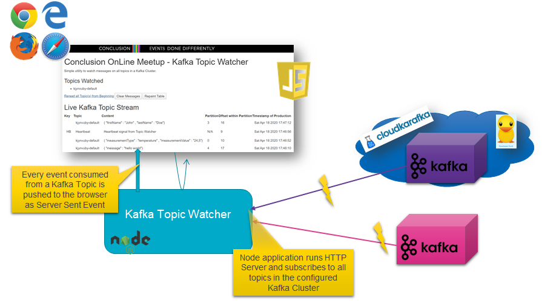

# Lab 2b - Kafka Topic Watcher - A Streaming Web UI for Monitoring Kafka Topics

This Bonus lab introduces a handy tool: a web GUI that monitors Kafka Topics, instantly pushing new messages from the monitored topic(s) to your browser. It is implemented in Node, using all the same mechanisms you have seen in Lab 2 - with one additional mechanism: Server Sent Events. 

The user interface of the Kafka Topic Monitor looks like this:


The solution design for this tool is shown next:



Note: the resources for this lab are in the lab2b folder in the [Git repo on GitHub](https://github.com/AMIS-Services/kafka-introduction-workshop). 

## Overview

The heart of the Kafka Topic Watcher is the Node application - of which app.js is the main module. This module:
* starts an HTTP Server (port 3010) for serving the web application (a few static files - HTML, Javascript and images)
* handles REST requests from the web application
* pushes SSE (Server Sent Events) to the web application (using the SSE support in *sse.js*)
* imports and initializes the *consume* module that connects to the target Kafka Cluster (as specified in *config.js*)
* set a message handler with the *consume* module for  handling the messages from all topics in the Kafka Cluster: function *handleMessage*. This function prepares the event to push to the browser and uses function *updateSseClients* and the *sse.js* module for sending a SSE event to all connected Kafka Topic Watcher clients.

The web application consists of file *index.html* and two supporting (client side) JavaScript files: *message-handler.js* and *topics-management.js*. The former subscribes to the SSE endpoint and handles the SSE Events that are pushed from the Node application for each message consumed from one of the Kafka Topics. The messages are collected in a *messages* array as well as written to the top of the *topicMessagesTable* HTML Table element.

The current list of Topics on the Kafka Cluster are requested from the Node application in an XHR (aka AJAX request), from *topic-management.js*. A list of topics is written to the HTML page based on the response content for this request. 

The GUI contains a button *Clear Messages*. When pressed, function *clearMessages* is invoked (in message-handler.js). It clears the *messages* array and removes the rows from the *topicMessagesTable*.

The GUI also contains a link *Reread all Topic(s) from Beginning*. When clicked on, function *config* is triggered that in turns sends a POST request to the */config* endpoint that subsequently reinitializes the consumer with a flag specifiying that all messages are to be read from all topics, not just the newly arriving messages; function *initializeConsumer* is invoked and will disconnect the current Stream Consumer and create a new one. 

## Running the Kafka Topic Watcher

The Kafka Topic Watcher is almost ready to go. You do not need to make changes to the code in order to get it to fun - except to make sure that *file config.js* has the correct settings for your environment: the Kafka Broker configuration (for your local cluster or for example for a CloudKarafka cloud based cluster) needs to be defined. 

Before you can run the application, you need to bring in the dependencies. From the command line in the directory that contains file *package.json* run:
```
npm install
```
to download all required NPM modules into the directory node-modules.

Now you can run the web application:
```
node app.js
```
or
```
npm start
```
The HTTP server is started and listens on port 3010.

From a browser open the Kafka Topic Watcher web application: [http://localhost:3010](http://localhost:3010).

You should see a list of all non-internal topics in the designated Kafka Cluster. And you will see all new messages produced to these topics. You can click on the link *Reread all Topic(s) from Beginning* to see all messages from the topics' history. In addition to the real messages from Kafka Topics, you will also see heartbeat messages that are sent every 25 seconds by the Node application to all SSE clients.

## TODO
Even though the Kafka Topic Watcher is doing what it is supposed to, it can easily be improved. Some suggestions - that the reader may take as a challenge to accept:
* allow filtering on specific Topics
* allow sorting on various properties
* improve the look & feel of the GUI with styles, fonts and widgets
* allow *publishing* messages in addition to consuming them
* allow the target Kafka Cluster to be set from the GUI (or even to consume from multiple clusters at the same time)

